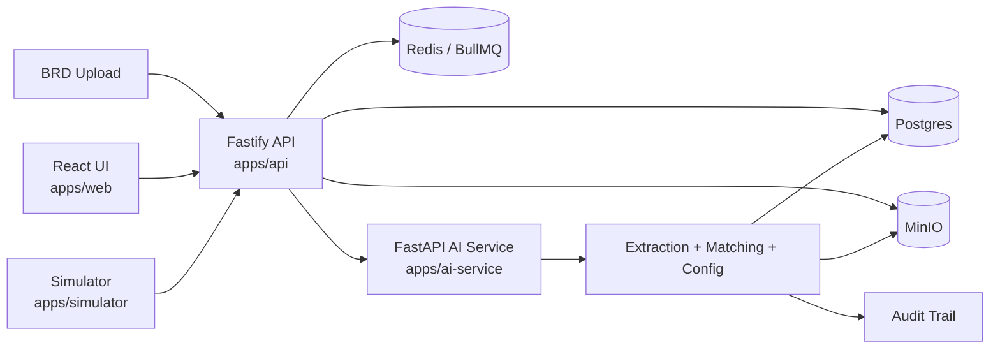

# Finspark Orchestrator

Finspark Orchestrator is a lending-integration platform that converts business requirement documents into tenant-scoped configs, adapter mappings, and orchestration DAGs.

<p align="center">
	
	
	
	
</p>

## System Overview

The platform follows a simple pipeline:

1. A tenant uploads a BRD.
2. The API stores the document and metadata.
3. The AI service extracts requirements, matches adapters, and generates a config.
4. The system persists audit events, versioned configs, and DAG nodes.
5. The UI and simulator let operators review and validate the result.



## What Lives Where

| Area | Path | Purpose |
|---|---|---|
| API | [apps/api](apps/api) | Tenant bootstrap, upload, config, audit, simulation endpoints |
| AI service | [apps/ai-service](apps/ai-service) | OCR, extraction, adapter matching, config generation, safety checks |
| Web UI | [apps/web](apps/web) | Operator interface |
| Simulator | [apps/simulator](apps/simulator) | Scenario and version testing |
| Shared package | [packages/shared](packages/shared) | Schemas, constants, shared types |
| Config package | [packages/config](packages/config) | Environment loading and vault helpers |
| Database migrations | [infra/postgres/migrations](infra/postgres/migrations) | Schema and feature migrations |
| Scripts | [scripts](scripts) | Seed, reset, test fixtures, and runners |

## Core Capabilities

- Tenant isolation across documents, configs, audits, and secrets
- Requirement extraction with confidence scoring and ambiguity tracking
- Adapter matching and config generation
- DAG creation for sequential, parallel, and conditional flows
- Safety checks and approval-state transitions
- Live smoke tests and larger orchestration scenarios

## Quick Start

```bash
npm install
docker compose up -d
npm run migrate:fresh
npm run dev:api
npm run dev:ai
```

## Common Commands

| Command | Purpose |
|---|---|
| `npm run migrate` | Apply database migrations |
| `npm run seed` | Seed registry and demo data |
| `npm run migrate:fresh` | Reset database state, then seed it |
| `npm run dev:api` | Start the API service in watch mode |
| `npm run dev:ai` | Start the AI service with reload |
| `npm test` | Run the live smoke test |
| `npm exec --yes tsx scripts/test-suites.ts` | Run the broader live test suite |

## Health Checks

- API: `http://127.0.0.1:8000/health`
- AI service: `http://127.0.0.1:8002/health`

## Testing Story

The repository includes progressively harder validation flows:

| Case | Focus | Outcome |
|---|---|---|
| 1 | Partial BRD handling | Extracts valid requirements and flags missing sections |
| 2 | Multi-tenant amendment | Preserves isolation during surgical config updates |
| 3 | Regulatory complexity | Detects contradictions and supports rollback paths |
| 4 | Catastrophic resilience | Exercises adapter corruption, injection blocking, and split-brain recovery |

## Notes

- The live smoke test is the fastest end-to-end check.
- The broader test suite covers the multi-step orchestration behavior.
- README files in subprojects are ignored so this root file stays the main entrypoint.
