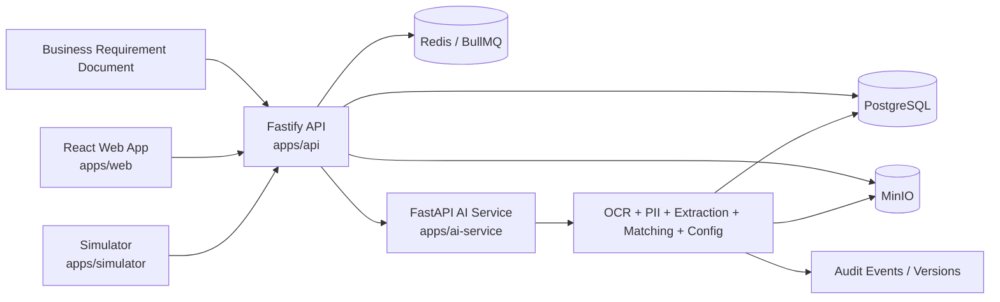

# Finspark Orchestrator

Finspark Orchestrator is a phase-locked lending-integration monorepo that turns business requirement documents into tenant-scoped adapter configs, structured extraction output, simulation runs, and audit-ready approval history. The project is organized around a controlled pipeline: ingest a BRD, extract requirements, match adapters, generate a config graph, validate the result, and persist every significant decision as versioned state.

The repository is intentionally split into a small set of runtime services plus shared workspace packages. The goal is to keep the platform understandable, reproducible, and easy to validate end to end.

## At A Glance

- Monorepo managed with npm workspaces.
- Primary API written in Node.js with Fastify.
- AI/extraction service written in Python with FastAPI/Uvicorn.
- Simulator service written in Node.js for schema, dry-run, and mock validation.
- Shared workspace packages for schemas, constants, and config helpers.
- PostgreSQL for durable records and version history.
- Redis/BullMQ for queueing and workflow coordination.
- MinIO for document/object storage.
- React/Vite web app for operator-facing UI.

## Architecture

The system is built around a straightforward control-plane flow:

1. A tenant is bootstrapped through the API.
2. The tenant uploads a BRD or other source document.
3. The API stores the document, deduplicates repeated uploads, and queues processing.
4. The AI service extracts requirements, performs PII handling, matches adapters, and generates a versioned config payload.
5. The API persists configs, approvals, audit events, and simulation state.
6. The simulator validates schema compatibility, dry-run behavior, and mock scenarios.
7. Operators review outcomes through the web app and through the test reports under docs/test-reports.



## Repository Layout

| Path | Purpose |
|---|---|
| [apps/api](apps/api) | Main control-plane API for tenants, documents, configs, approvals, simulations, secrets, and audit flows |
| [apps/ai-service](apps/ai-service) | Python pipeline for OCR, extraction, PII redaction, adapter matching, config generation, and safety logic |
| [apps/simulator](apps/simulator) | Simulation and version-comparison service used to validate schema, dry-run, and mock scenarios |
| [apps/web](apps/web) | React/Vite operator UI and a simple health endpoint used in local orchestration |
| [packages/shared](packages/shared) | Shared TypeScript schemas, constants, and types used across the workspace |
| [packages/config](packages/config) | Environment loading and vault-related helpers |
| [infra/postgres/migrations](infra/postgres/migrations) | SQL migrations for the domain model, seeded adapters, config metadata, and governance features |
| [scripts](scripts) | Migration helpers, seeds, demo scripts, health checks, test runners, and fixture data |
| [docs/test-reports](docs/test-reports) | Written evidence from live scenario runs and readiness analysis |

## Services

### API Service

The API service is the main orchestration surface. It handles:

- tenant bootstrap and tenant-scoped authentication,
- document upload and deduplication,
- document status and requirements retrieval,
- config versioning and activation,
- emergency rollback,
- secret reference resolution,
- simulation dispatch and result retrieval,
- audit trail access,
- adapter and adapter-version listing.

Relevant source files include [apps/api/src/index.ts](apps/api/src/index.ts), [apps/api/src/db.ts](apps/api/src/db.ts), [apps/api/src/storage.ts](apps/api/src/storage.ts), [apps/api/src/queue.ts](apps/api/src/queue.ts), [apps/api/src/secrets.ts](apps/api/src/secrets.ts), and [apps/api/src/tenant-middleware.ts](apps/api/src/tenant-middleware.ts).

### AI Service

The AI service is the pipeline engine. It exposes the document processing entrypoint and orchestrates:

- OCR/structure extraction,
- PII redaction with regex and model-assisted fallbacks,
- requirement extraction,
- adapter matching,
- deterministic config generation,
- safety scanning and policy checks,
- extension-style pipeline behaviors used in the test flows.

Relevant source files include [apps/ai-service/app/main.py](apps/ai-service/app/main.py) and the pipeline modules under [apps/ai-service/app/pipeline](apps/ai-service/app/pipeline).

### Simulator

The simulator validates generated configs and adapter versions. It is used for:

- schema checks,
- dry-run validation,
- mock-response validation,
- parallel version comparison,
- rename and breaking-change detection,
- fallback behavior when external mock services are unavailable.

Relevant source files include [apps/simulator/src/index.ts](apps/simulator/src/index.ts) and [apps/simulator/src/parallel-version-test.ts](apps/simulator/src/parallel-version-test.ts).

### Web App

The web app is the operator-facing frontend and health endpoint. It is intentionally lightweight in this repository, but it remains part of the workspace and container stack for full-system orchestration.

Relevant files include [apps/web/package.json](apps/web/package.json) and [apps/web/health-server.mjs](apps/web/health-server.mjs).

## Core Domain Concepts

### Tenants

Every document, config, approval, secret reference, and audit event is tenant-scoped. The repository includes middleware and API behavior intended to prevent cross-tenant reads and writes.

### Documents

Documents are uploaded BRDs or supporting artifacts. The API stores metadata, tracks parse status, and supports deduplication by fingerprint so repeated uploads return the existing document instead of creating duplicates.

### Requirements

The AI pipeline extracts requirements from a document and writes structured requirement data that can feed matching and config generation.

### Adapters and Adapter Versions

The adapter registry holds vendor integrations such as bureau, KYC, GST, fraud, payment, and open-banking providers. Versions are important because the simulator and approval flow compare schema changes between versions.

### Configurations

Configs are versioned, tenant-scoped outputs that include field mappings, DAG nodes, version metadata, and audit-relevant state transitions.

### Approvals and Rollbacks

Approval workflows support activation and rollback behavior. The repository includes emergency rollback support and governance-oriented migrations for approvals and rollbacks.

### Simulations

Simulation runs are used to validate generated configs before deployment or activation. The repo includes schema, dry-run, and mock modes, plus parallel version comparison logic.

### Audit Events

Significant actions are recorded in Postgres as audit events. The current schema supports standard before/after tracking and governance metadata for approvals and rollback behavior.

## Database Migrations

The migration set defines the main domain model and later capability layers:

| Migration | Focus |
|---|---|
| [001_full_domain_model.sql](infra/postgres/migrations/001_full_domain_model.sql) | Base domain tables for tenants, documents, configs, approvals, simulation runs, and audit events |
| [002_seed_registry_and_demo.sql](infra/postgres/migrations/002_seed_registry_and_demo.sql) | Adapter registry and demo data |
| [003_tenant_security_and_document_processing.sql](infra/postgres/migrations/003_tenant_security_and_document_processing.sql) | Tenant security and document-processing enhancements |
| [004_documents_structured_content.sql](infra/postgres/migrations/004_documents_structured_content.sql) | Structured document content support |
| [005_requirements_extraction_fields.sql](infra/postgres/migrations/005_requirements_extraction_fields.sql) | Requirement extraction fields |
| [006_adapter_embeddings_and_config_metadata.sql](infra/postgres/migrations/006_adapter_embeddings_and_config_metadata.sql) | Adapter embeddings and config metadata |
| [007_dag_nodes_condition_jsonb.sql](infra/postgres/migrations/007_dag_nodes_condition_jsonb.sql) | DAG node condition JSONB support |
| [008_approval_scope_and_governance.sql](infra/postgres/migrations/008_approval_scope_and_governance.sql) | Approval scope and governance model |

## Shared Packages

### packages/shared

Contains reusable TypeScript definitions and constraints used by multiple workspaces. Source files are under [packages/shared/src](packages/shared/src).

### packages/config

Contains environment and vault helpers. Source files are under [packages/config/src](packages/config/src).

These packages keep the workspace consistent and prevent each app from re-implementing the same schema or environment logic.

## Scripts And Tooling

The root [package.json](package.json) exposes the main project commands:

| Command | Purpose |
|---|---|
| `npm install` | Install workspace dependencies |
| `npm run migrate` | Apply database migrations |
| `npm run seed` | Seed registry and demo data |
| `npm run migrate:fresh` | Apply migrations and then seed from scratch |
| `npm run demo:seed` | Seed the demo set used by the local environment |
| `npm run demo:run` | Run the end-to-end demo script |
| `npm run health:check` | Run the workspace health check script |
| `npm run dev:api` | Start the API in watch mode |
| `npm run dev:ai` | Start the AI service with reload |
| `npm test` | Run the live phase test runner |

The `scripts/` folder contains the implementation used by those commands:

| File | Purpose |
|---|---|
| [scripts/migrate.mjs](scripts/migrate.mjs) | Applies SQL migrations |
| [scripts/seed.mjs](scripts/seed.mjs) | Seeds the database |
| [scripts/demo-seed.mjs](scripts/demo-seed.mjs) | Adds extra demo data |
| [scripts/demo-run.sh](scripts/demo-run.sh) | Runs the demo workflow |
| [scripts/health-check.sh](scripts/health-check.sh) | Checks service readiness |
| [scripts/test-plain.mjs](scripts/test-plain.mjs) | Main 11-phase live smoke test |
| [scripts/test-all-phases.mjs](scripts/test-all-phases.mjs) | Extended phase runner |
| [scripts/run-test-case-1.mjs](scripts/run-test-case-1.mjs) | TC1 scenario runner |
| [scripts/run-test-case-2.mjs](scripts/run-test-case-2.mjs) | TC2 scenario runner |
| [scripts/test-case-4-fixtures.json](scripts/test-case-4-fixtures.json) | Catastrophic fixture data |

## Environment Variables

The repository ships with [`.env.example`](.env.example) as the canonical starting point.

| Variable | Purpose |
|---|---|
| `NODE_ENV` | Runtime mode |
| `JWT_SECRET` | JWT signing secret for tenant auth |
| `SECRET_ENCRYPTION_KEY` | Secret encryption key |
| `POSTGRES_DB` | Database name |
| `POSTGRES_USER` | Database user |
| `POSTGRES_PASSWORD` | Database password |
| `POSTGRES_HOST` | Database host |
| `POSTGRES_PORT` | Database port |
| `DATABASE_URL` | Full Postgres connection string |
| `REDIS_PORT` | Redis host port |
| `REDIS_URL` | Redis connection string |
| `MINIO_ROOT_USER` | MinIO root user |
| `MINIO_ROOT_PASSWORD` | MinIO root password |
| `MINIO_API_PORT` | MinIO API port |
| `MINIO_CONSOLE_PORT` | MinIO console port |
| `MINIO_ENDPOINT` | MinIO hostname |
| `MINIO_USE_SSL` | Whether MinIO uses SSL |
| `MINIO_BUCKET_DOCS` | Bucket used for document storage |
| `WEB_PORT` | Web app port |
| `API_PORT` | API service port |
| `AI_SERVICE_PORT` | AI service port |
| `SIMULATOR_PORT` | Simulator port |
| `AI_SERVICE_URL` | URL used by the API and runners to reach the AI service |
| `GLINER_API_KEY` | GLiNER integration key, optional in local dev |
| `GLINER_BASE_URL` | GLiNER/OpenAI-compatible API base URL |
| `GLINER_MODEL` | GLiNER PII model name |
| `NVIDIA_OCR_ENDPOINT` | OCR endpoint |
| `NVIDIA_CHAT_ENDPOINT` | Chat/completions endpoint |
| `NVIDIA_GLINER_MODEL` | PII model name |
| `NVIDIA_REQUIREMENTS_MODEL` | Requirements model name |
| `NVIDIA_EMBEDDINGS_MODEL` | Embeddings model name |
| `NVIDIA_RERANK_MODEL` | Reranking model name |

## Local Development

### Prerequisites

- Node.js 20.11 or newer.
- npm.
- Python 3.11 for the AI service.
- Docker and Docker Compose.
- A running Postgres, Redis, and MinIO stack, either via Docker Compose or local equivalents.

### First Run

```bash
npm install
docker compose up -d
npm run migrate:fresh
```

Then start the app services you want to inspect:

```bash
npm run dev:api
npm run dev:ai
```

If you want the broader local stack, use the containers defined in [docker-compose.yml](docker-compose.yml).

### Recommended Local Flow

1. Copy [`.env.example`](.env.example) to `.env` and set local overrides.
2. Start Postgres, Redis, and MinIO.
3. Run `npm run migrate:fresh`.
4. Run `npm run dev:api` and `npm run dev:ai`.
5. Use `npm test` or the scenario runners to validate the system.

## Docker Compose Stack

The root [docker-compose.yml](docker-compose.yml) defines:

- Postgres 16 for durable storage,
- Redis 7 for queueing and job coordination,
- MinIO for document storage,
- a web container,
- an API container,
- an AI service container,
- a simulator container.

Health checks are configured for each service so the stack can be brought up in a deterministic order.

The default service ports are:

- Web: `3000`
- API: `8000`
- AI service: `8002`
- Simulator: `8003`
- Postgres: `5432`
- Redis: `6379`
- MinIO API: `9000`
- MinIO console: `9001`

## API And Pipeline Endpoints

The exact surface evolves, but the major areas are:

- `/health` for readiness checks,
- `/api/tenants/bootstrap` for tenant creation,
- `/api/documents/upload` for document ingestion,
- `/api/documents/:id` and `/api/documents/:id/status` for document inspection,
- `/api/documents/:id/requirements` for extracted requirements,
- `/api/configs` and config activation/rollback routes,
- `/api/secrets/refs` for secret reference inspection,
- `/api/adapters` and `/api/adapters/:category` for registry access,
- `/api/simulations/run` for scenario validation,
- AI service `/process-document` for document processing.

For implementation details, see [apps/api/src/index.ts](apps/api/src/index.ts) and [apps/ai-service/app/main.py](apps/ai-service/app/main.py).

## Testing And Validation

The repository uses live tests rather than pure theory checks. The main smoke path is `npm test`, which runs [scripts/test-plain.mjs](scripts/test-plain.mjs) against the live API and AI service.

### What The Main Test Covers

The phase runner validates:

- infrastructure health,
- schema and migration assumptions,
- adapter seed data,
- tenant bootstrap and secret isolation,
- document upload and deduplication,
- OCR and structured extraction,
- requirement extraction,
- adapter matching,
- config generation,
- version metadata,
- security and cross-tenant behavior.

### Scenario Runners

Two standalone scenario runners are included:

- [scripts/run-test-case-1.mjs](scripts/run-test-case-1.mjs)
- [scripts/run-test-case-2.mjs](scripts/run-test-case-2.mjs)

They write evidence into [scripts/test-case-1-output.json](scripts/test-case-1-output.json) and [scripts/test-case-2-output.json](scripts/test-case-2-output.json), and the written reports live under [docs/test-reports](docs/test-reports).

### Test Case 3 Status

There is a readiness report for TC3 at [docs/test-reports/test-case-3-catastrophic.md](docs/test-reports/test-case-3-catastrophic.md). It is not a successful execution record; it documents gaps that still need implementation before a real TC3 runner can pass.

## Current Validation Status

At the time this README was written:

- the live main smoke test passes,
- the TC1 live scenario has a written result,
- the TC2 live scenario has a written result,
- TC3 is documented as readiness-only and is not yet a passed live run,
- the repository includes the runner scripts and the evidence artifacts for the implemented scenarios.

## Development Notes

- The monorepo keeps runtime boundaries small on purpose.
- The API owns orchestration and persistence.
- The AI service owns extraction and config synthesis.
- The simulator owns validation and version comparison.
- Shared packages are used to prevent schema drift across apps.
- Migrations are the authoritative source for database shape.

When changing behavior, prefer fixing the pipeline where the data is created rather than patching downstream consumers.

## Troubleshooting

### Service Won't Start

- Check that the correct `.env` values are loaded.
- Confirm Postgres, Redis, and MinIO are reachable.
- Verify the migration state before starting the API or AI service.

### Document Upload Fails

- Confirm the JWT or API key is valid.
- Check that MinIO bucket configuration matches `MINIO_BUCKET_DOCS`.
- Ensure the database schema is current.

### AI Processing Returns Incomplete Data

- Check `GLINER_API_KEY` and model variables if the external path is expected.
- Review the fallback logic in the AI service pipeline modules.
- Confirm the document content was uploaded successfully and has not been blocked by safety logic.

### Simulation Or Version Comparison Fails

- Confirm the relevant config version exists.
- Verify the adapter seed data is present.
- Check the simulator service logs and the current DB schema.

## Reference Files

- [package.json](package.json)
- [docker-compose.yml](docker-compose.yml)
- [apps/api/src/index.ts](apps/api/src/index.ts)
- [apps/ai-service/app/main.py](apps/ai-service/app/main.py)
- [apps/simulator/src/index.ts](apps/simulator/src/index.ts)
- [apps/web/package.json](apps/web/package.json)
- [infra/postgres/migrations/001_full_domain_model.sql](infra/postgres/migrations/001_full_domain_model.sql)
- [infra/postgres/migrations/002_seed_registry_and_demo.sql](infra/postgres/migrations/002_seed_registry_and_demo.sql)
- [scripts/test-plain.mjs](scripts/test-plain.mjs)
- [docs/test-reports/test-case-1-medium.md](docs/test-reports/test-case-1-medium.md)
- [docs/test-reports/test-case-2-hard.md](docs/test-reports/test-case-2-hard.md)
- [docs/test-reports/test-case-3-catastrophic.md](docs/test-reports/test-case-3-catastrophic.md)

## Summary

Finspark Orchestrator is a monorepo for document-driven lending integrations, tenant-safe config generation, and live validation of adapter workflows. The root README is the main project entrypoint, and the rest of the repository is structured to keep the data model, pipeline, and operational scripts aligned.
